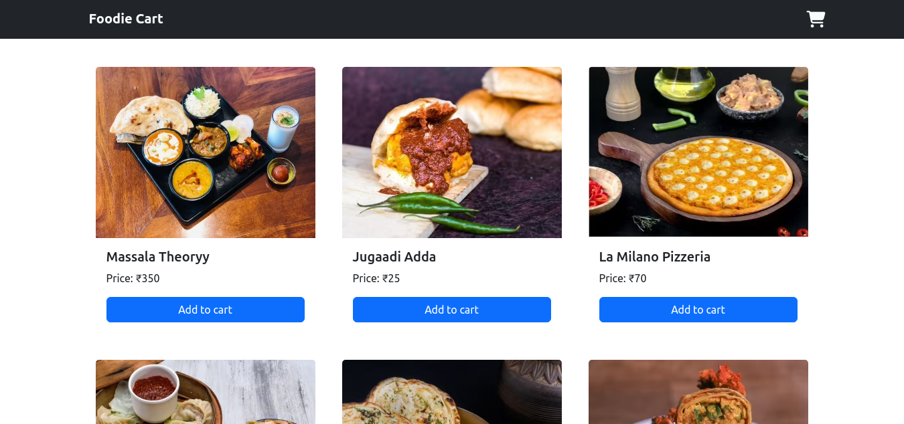
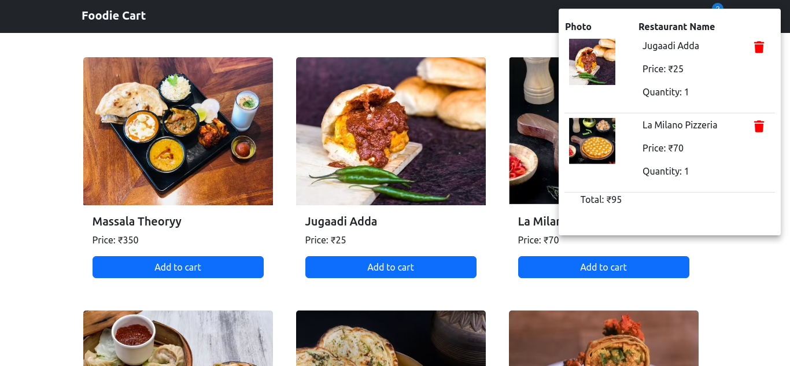
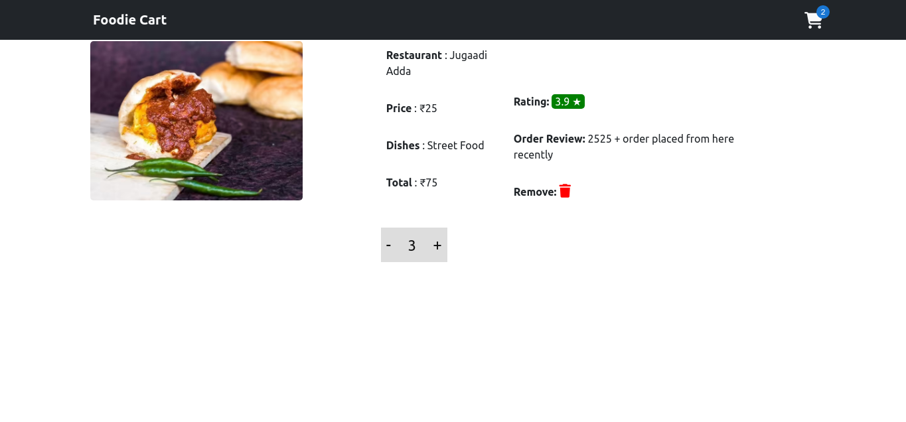

# Foodie Cart

This project shows cart implementation for online food delivery app using react, redux, bootstarp and material-ui

## Demo

https://foodie-cart-skolap.web.app/

## Getting Started

- clone repo
- `npm install`
- `npm start`

## Tech Stack

React, Redux, Bootstarp, Material Ui, React Router, Font Awesome

## Features

- Add to cart
- Remove from Cart
- Increase / Decrease quantity

## Authors

- Shailesh Kolap - [skolap](https://github.com/Skolap)

## Screenshots

  
  
  

<!-- 

 -->
